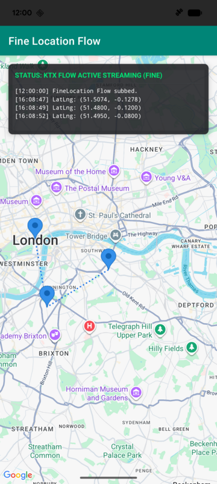
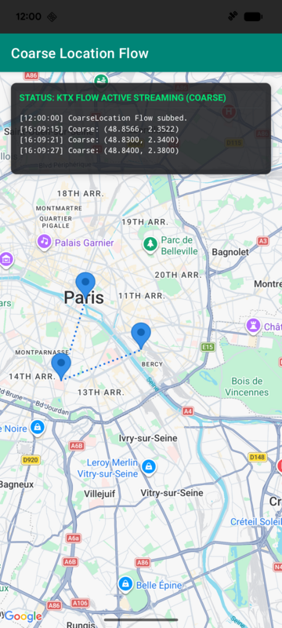
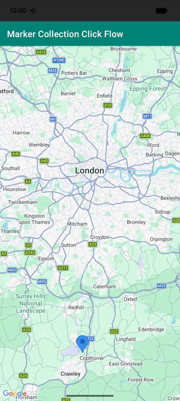
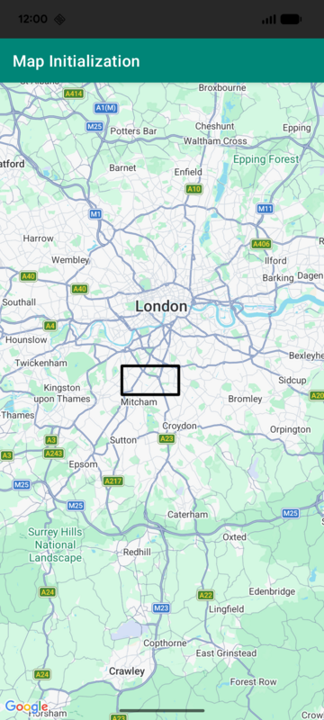
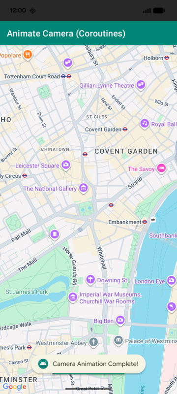

# 🚀 Android Maps KTX Flow Snippets Catalog

This directory contains standalone code snippets demonstrating how to consume the newly added Kotlin Flow extensions inside the `maps-utils-ktx` library. 

All snippets are enclosed in standard developer documentation region tags to make them easily importable into public guides, and are verified automatically via mock unit tests to prevent regressions.

## 📊 KTX Flow Snippet Status

| Feature | Status | Source Code | Visual Preview | Region Tag | Description |
| :--- | :---: | :--- | :--- | :--- | :--- |
| **Fine Location Flow** | ✅ Verified | [Source Code](../app/src/main/java/com/google/maps/android/ktx/demo/snippets/LocationSnippets.kt#L71-L84) ([Activity](../app/src/main/java/com/google/maps/android/ktx/demo/execution/SnippetExecutionActivity.kt#L132)) |  | `maps_android_ktx_flow_fine_location` | Streams high-precision device coordinate updates reactively using GPS, with an automatic start/stop subscriber lifecycle. |
| **Coarse Location Flow** | ✅ Verified | [Source Code](../app/src/main/java/com/google/maps/android/ktx/demo/snippets/LocationSnippets.kt#L45-L58) ([Activity](../app/src/main/java/com/google/maps/android/ktx/demo/execution/SnippetExecutionActivity.kt#L135)) |  | `maps_android_ktx_flow_coarse_location` | Streams coarse WiFi/Cell device coordinate updates reactively using network/passive providers, closing cleanly on setting disablement. |
| **Cluster Clicks** | ✅ Verified | [Source Code](../app/src/main/java/com/google/maps/android/ktx/demo/snippets/ClusteringSnippets.kt#L44-L51) ([Activity](../app/src/main/java/com/google/maps/android/ktx/demo/execution/SnippetExecutionActivity.kt#L138)) |  | `maps_android_ktx_flow_cluster_clicks` | Reactively streams click events on clustered groups of markers instead of overriding standard camera callbacks. |
| **Cluster Item Clicks** | ✅ Verified | [Source Code](../app/src/main/java/com/google/maps/android/ktx/demo/snippets/ClusteringSnippets.kt#L64-L86) ([Activity](../app/src/main/java/com/google/maps/android/ktx/demo/execution/SnippetExecutionActivity.kt#L138)) |  | `maps_android_ktx_flow_cluster_item_clicks` | Listens to individual marker click events within clusters. Demonstrates how to use `.shareIn()` to safely broadcast to multiple active observers. |
| **Marker Collection Clicks** | ✅ Verified | [Source Code](../app/src/main/java/com/google/maps/android/ktx/demo/snippets/CollectionSnippets.kt#L41-L48) ([Activity](../app/src/main/java/com/google/maps/android/ktx/demo/execution/SnippetExecutionActivity.kt#L141)) |  | `maps_android_ktx_flow_marker_collection_clicks` | Listens to marker click events on separate styled collections managed by `MarkerManager`. |
| **Circle Collection Clicks** | ✅ Verified | [Source Code](../app/src/main/java/com/google/maps/android/ktx/demo/snippets/CollectionSnippets.kt#L59-L66) ([Activity](../app/src/main/java/com/google/maps/android/ktx/demo/execution/SnippetExecutionActivity.kt#L141)) |  | `maps_android_ktx_flow_circle_collection_clicks` | Listens to circle click events on separate styled collections managed by `CircleManager`. |
| **Map Init (Coroutines)** | ✅ Verified | [Source Code](../app/src/main/java/com/google/maps/android/ktx/demo/snippets/ExistingKtxSnippets.kt#L50-L56) ([Activity](../app/src/main/java/com/google/maps/android/ktx/demo/execution/SnippetExecutionActivity.kt#L106)) |  | `maps_android_ktx_coroutines_init` | Retrieves the GoogleMap instance safely inside a lifecycle-aware coroutine scope without legacy callback blocks. |
| **Animate Camera (Coroutines)** | ✅ Verified | [Source Code](../app/src/main/java/com/google/maps/android/ktx/demo/snippets/ExistingKtxSnippets.kt#L69-L78) ([Activity](../app/src/main/java/com/google/maps/android/ktx/demo/execution/SnippetExecutionActivity.kt#L112)) |  | `maps_android_ktx_coroutines_animate` | Smoothly animates the map camera and suspends coroutine execution, resuming only after the animation fully completes. |
| **Camera Idle Events Flow** | ✅ Verified | [Source Code](../app/src/main/java/com/google/maps/android/ktx/demo/snippets/ExistingKtxSnippets.kt#L89-L96) ([Activity](../app/src/main/java/com/google/maps/android/ktx/demo/execution/SnippetExecutionActivity.kt#L126)) |  | `maps_android_ktx_flow_camera_events` | Streams map camera stationary idle state changes dynamically via Flow. |
| **Polygon Containment Check** | ✅ Verified | [Source Code](../app/src/main/java/com/google/maps/android/ktx/demo/snippets/ExistingKtxSnippets.kt#L106-L109) ([Activity](../app/src/main/java/com/google/maps/android/ktx/demo/execution/SnippetExecutionActivity.kt#L106)) |  | `maps_android_ktx_utils_polygon_contains` | Performs robust polygon bounds checking to see if a LatLng coordinate is contained inside. |
| **GeoJSON Overlay Builder** | ✅ Verified | [Source Code](../app/src/main/java/com/google/maps/android/ktx/demo/snippets/ExistingKtxSnippets.kt#L120-L127) ([Activity](../app/src/main/java/com/google/maps/android/ktx/demo/execution/SnippetExecutionActivity.kt#L106)) |  | `maps_android_ktx_utils_geojson` | Dynamically parses and overlay a styled GeoJSON vector layer on top of the map view. |

---

## 🧪 Snippet Verification Testing
To ensure these snippets remain 100% correct and compile warning-free after library and dependency upgrades, they are covered by a dedicated unit test suite:
📂 [SnippetVerificationTest.kt](../app/src/test/java/com/google/maps/android/ktx/demo/snippets/SnippetVerificationTest.kt)

You can execute these tests locally at any time:
```bash
./gradlew :app:test --tests "com.google.maps.android.ktx.demo.snippets.*"
```
